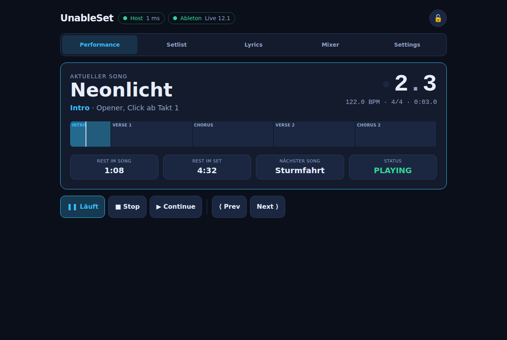
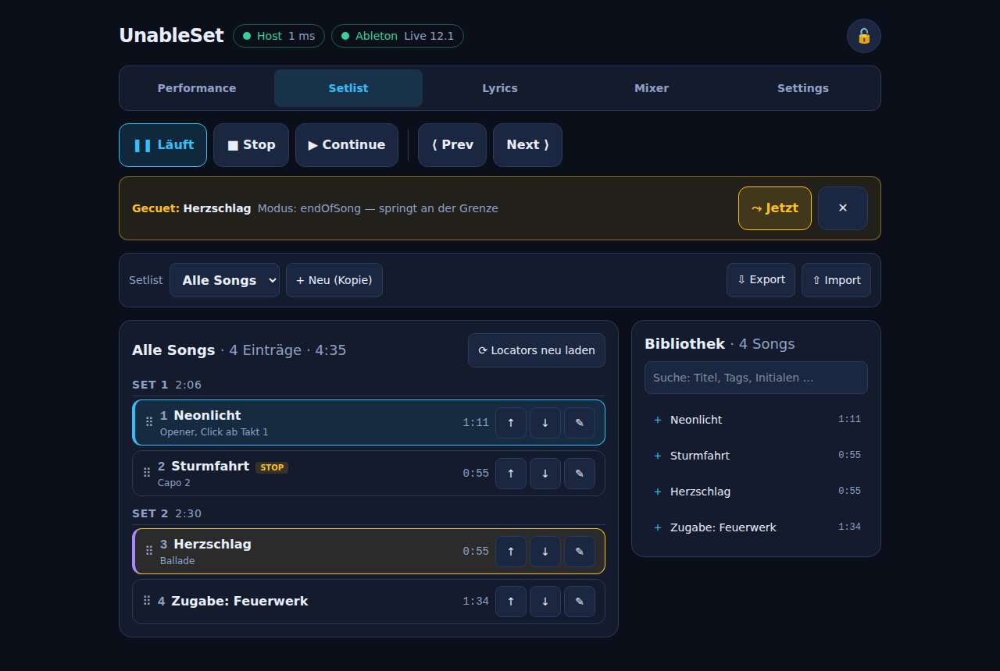
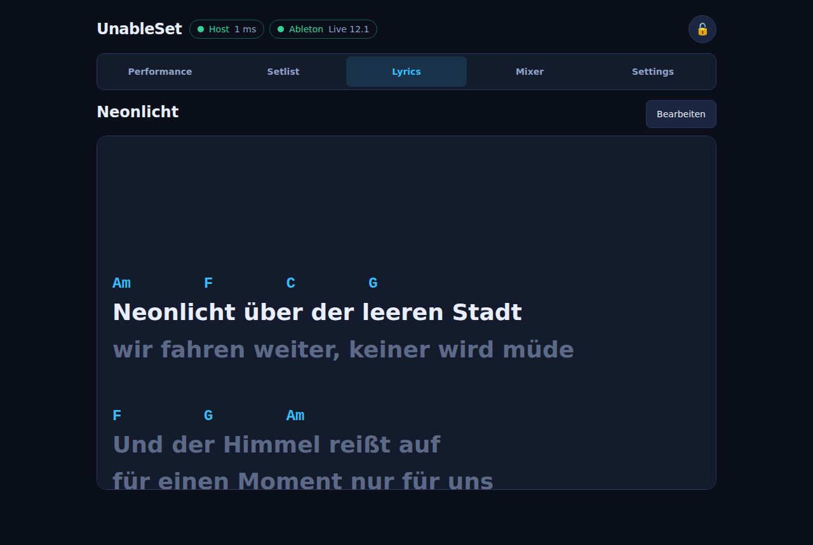
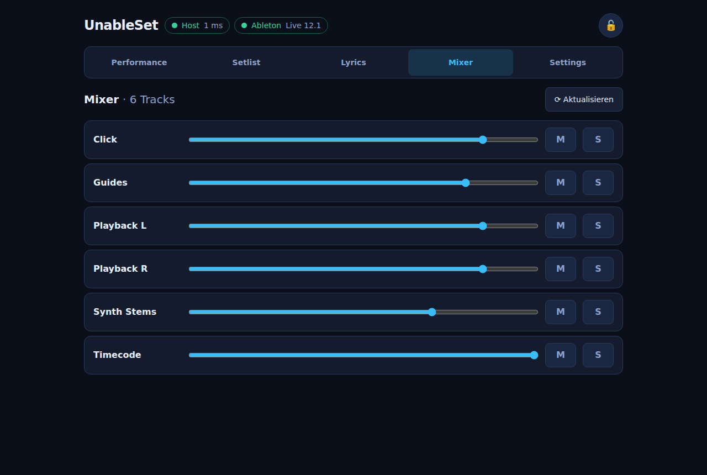
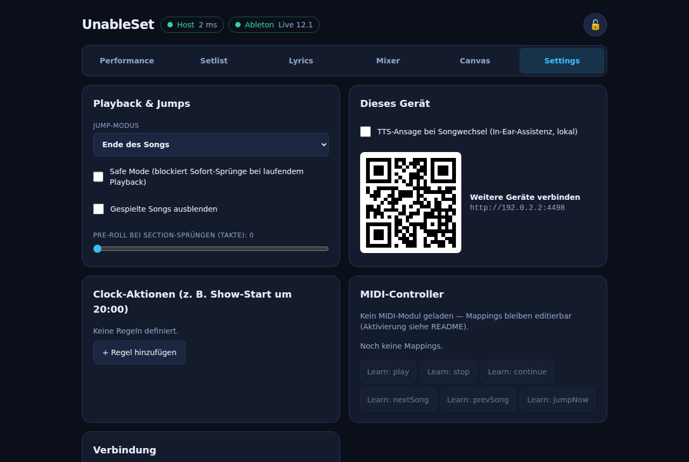
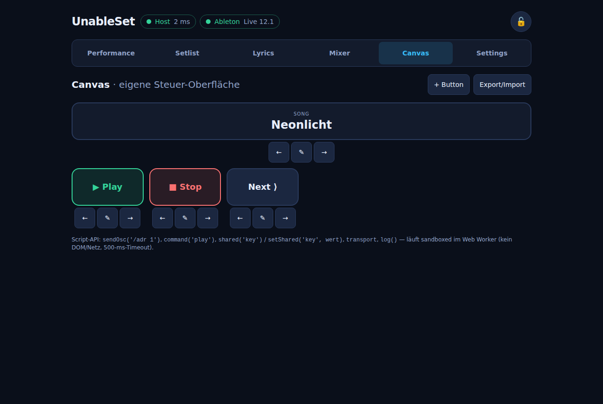
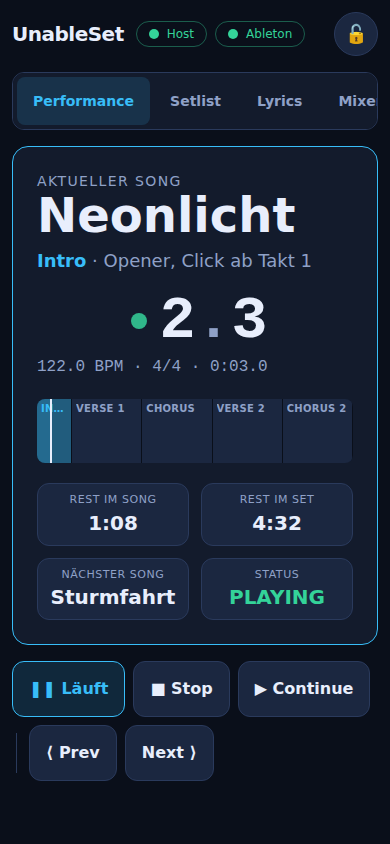

# UnableSet

Browser-basierter Setlist- und Playback-Controller für Ableton Live —
quelloffene, eigenständige Neuimplementierung. Ein MD/Playback-Engineer,
Musiker, Sänger oder Solo-Act steuert von jedem Gerät im LAN (Handy, iPad,
Laptop, Fußcontroller) eine aus Ableton-Locators erzeugte, live umsortierbare
Setlist — **ohne die Live-Session anzufassen** und **ohne Internetverbindung**.



## Features

- **Setlist aus Ableton-Locators**: Songs, Beschreibungen (`{…}`), Sections
  (`>Chorus`), Marker (`SONG END`, `STOP`), ignorierte Locators (`*`), Flags
  (`+LOOP:4`, `+STOP`) — die Live-Session wird nie verändert
- **Live umsortierbar**: Drag & Drop, Songs mehrfach, Sets mit Zwischensummen,
  Farben/Notizen/Tags, Skip, „gespielt"-Häkchen, Plaintext-Import/-Export,
  mehrere Setlists (Show-Presets)
- **Jump-Modi**: Quantisiert (Taktgrenze), Ende der Section, Ende des Songs,
  Dynamisch, Manuell — mit Queue + Hervorhebung und „Jetzt"-Button
- **Safe Mode** gegen versehentliche Sprünge, **Pre-Roll/Count-in** für Proben
- **Autoplay über die Setlist-Reihenfolge**: Songende springt zum nächsten
  Setlist-Eintrag (nicht zum Arrangement-Nachbarn); `STOP` hält an und
  bereitet den nächsten Song vor
- **Section-Loops** über das native Ableton-Loop-Bracket
- **Views pro Gerät**: Performance (Bühne), Setlist (MD), Lyrics-Teleprompter
  (Akkordzeilen + Auto-Scroll, **beat-synchron aus MIDI-Clips**), Mixer
  (Volume/Mute/Solo), **Canvas** (eigene Steuer-Oberfläche mit Buttons/OSC/
  sandboxed Scripting), Settings — alle sperrbar gegen versehentliche Bedienung
- **Anzeige**: Bar/Beat, BPM, Taktart, Timecode, Beat-Flash, Rest im Song,
  Rest im Set, nächster Song
- **Fernsteuerung**: Tastatur-Shortcuts, OSC-In (TouchOSC / Open Stage
  Control / **Bitfocus Companion**), MIDI-Mapping mit **Learn-Modus**
  (Fußcontroller; Hardware optional)
- **Import**: Plaintext und **CSV/BandHelper-Export** (Titel-Spalte wird
  automatisch erkannt); **Multi-File-Projekte** (Live-Datei pro Song, direkt
  aus der App öffnen)
- **OSC-Out-Feed** an Floor-Displays/Licht/Video (herstellerneutral) +
  `oscOnEnter`-Befehle pro Song (z. B. Licht-Preset beim Songstart)
- **Redundanz (M6)**: `--mirror` spiegelt alle Kommandos an Backup-Rigs,
  misst Drift und korrigiert automatisch — bis alle in Sync sind
- **Clock-Aktionen**: „um 20:00 → Play" (Show-Start, Curfew)
- **QR-Code** + **mDNS** (`_unableset._tcp`) zum schnellen Verbinden,
  **TTS-Ansage** des Songtitels (In-Ear-Assistenz, lokal via Web Speech API)
- **PWA**: installierbar (Add-to-Homescreen), Offline-Shell per Service
  Worker, Screen-Wake-Lock; skaliert auf 2000+ Marker (E2E-getestet)
- **Bühnentauglich**: Host crasht nie hart, Clients reconnecten automatisch
  mit vollem State-Snapshot, alles offline-first

| Setlist (MD) | Lyrics-Teleprompter |
|---|---|
|  |  |

| Mixer | Settings (MIDI-Learn, Redundanz, QR) |
|---|---|
|  |  |

| Canvas (eigene Steuer-Oberfläche + Scripting) | Performance (Smartphone) |
|---|---|
|  |  |

## Architektur

```
Ableton Live  ←OSC/UDP→  Host (Node/TS)  ←WebSocket→  Clients (Browser/PWA)
  AbletonOSC              Single Source                Performance · Setlist
  Remote-Script           of Truth                     · Lyrics · Mixer · Settings
```

- `packages/shared` — Datenmodell, WS-Protokoll, OSC-Adressen, Jump-/Beat-Mathematik ([PROTOCOL.md](packages/shared/PROTOCOL.md))
- `packages/bridge` — Ableton-Anbindung hinter dem `AbletonBridge`-Interface;
  **Weg A**: OSC via [AbletonOSC](https://github.com/ideoforms/AbletonOSC);
  **Weg B**: Max-for-Live-Device (`packages/bridge/m4l/`, beat-genaue 20-ms-
  Position). Enthält zusätzlich einen **AbletonOSC-Simulator** für
  Entwicklung/Tests ohne Live und die `MirrorBridge` für Redundanz.
- `apps/desktop` — optionale **Electron-Hülle** (Tray, Auto-Start,
  Floating-Window, Watchdog); der Host läuft auch komplett ohne Electron.
- `packages/server` — Host: Setlist-Engine, State-Store, WebSocket-Broadcast,
  REST, OSC-Remote, Clock-Scheduler, atomare JSON-Persistenz
- `packages/client` — React-PWA (React 19, Vite, Tailwind 4, Zustand)

Der Host ist die einzige Wahrheitsquelle; Clients sind synchronisierte
Ansichten mit automatischem Reconnect + vollem State-Snapshot.

## Installation & Start

Voraussetzungen: **Node ≥ 20**, **pnpm ≥ 9**, Ableton **Live 11/12** mit
installiertem [AbletonOSC](https://github.com/ideoforms/AbletonOSC)-Remote-Script.

**1. AbletonOSC installieren** (einmalig):
[Release herunterladen](https://github.com/ideoforms/AbletonOSC), Ordner
`AbletonOSC` in die Remote-Scripts-Ablage kopieren (macOS:
`~/Music/Ableton/User Library/Remote Scripts/`, Windows:
`%USERPROFILE%\Documents\Ableton\User Library\Remote Scripts\`), dann in Live
unter *Settings → Link/Tempo/MIDI → Control Surface* „AbletonOSC" wählen.

**2. UnableSet bauen & starten:**

```bash
pnpm install
pnpm build

# Host starten (liefert den Client gleich mit aus):
node packages/server/dist/index.js
# → http://localhost:4400 im Browser öffnen (weitere Geräte: QR-Code in Settings)
```

**3. Locators benennen** (siehe Notation unten), in der App „Locators neu
laden" — fertig.

### Ohne Ableton ausprobieren (Demo-Modus)

```bash
pnpm build
pnpm simulator          # simuliertes Live mit Demo-Session (4 Songs, Sections)
node packages/server/dist/index.js   # in zweitem Terminal
```

### Entwicklung

```bash
pnpm dev                # tsc-watch (shared+bridge) + Host + Vite-Dev-Server (:5173)
pnpm test               # Vitest: 122 Unit-/Integrationstests
pnpm test:e2e           # Playwright: 8 Headless-E2E der Bühnen-Flows
pnpm lint && pnpm typecheck
pnpm screenshots        # README-Screenshots headless neu erzeugen
```

### CLI-Flags des Hosts

| Flag | Default | Bedeutung |
|---|---|---|
| `--http-port` | `4400` | Web-UI + WebSocket + REST |
| `--osc-host` | `127.0.0.1` | Rechner, auf dem Live läuft |
| `--osc-port` | `11000` | AbletonOSC-Empfangsport |
| `--osc-listen-port` | `11001` | Antwort-Port |
| `--osc-remote-port` | `9000` | OSC-Fernsteuerung (0 = aus) |
| `--data-dir` | `./unableset-data` | Setlists/Settings (Tipp: in den Live-Projektordner legen — dann zieht beim Umzug alles mit) |
| `--mirror` | – | Backup-Rigs für Redundanz, z. B. `192.168.1.20:11000` |
| `--osc-out` | – | Ziele für den Status-Feed, z. B. `192.168.1.30:8000` |
| `--no-mdns` | – | mDNS-Advertising abschalten |

Der Host läuft headless auf macOS, Windows und Raspberry Pi 5 (arm64) —
z. B. als systemd-Service mit `Restart=always` (Watchdog).

## Locator-Notation

| Locator-Name | Bedeutung |
|---|---|
| `Songtitel` | startet einen Song |
| `Songtitel {Beschreibung}` | mit Beschreibung |
| `>Chorus` | Section innerhalb des laufenden Songs |
| `>Drop +LOOP:4` | loop-bare Section |
| `*Irgendwas` | wird ignoriert |
| `SONG END` | beendet den laufenden Song (Lücke bis zum nächsten) |
| `STOP` | beendet den Song, Playback hält dort an |
| `Titel +STOP` | Playback hält am Songende an |

Details: [PROTOCOL.md](packages/shared/PROTOCOL.md)

## Bedienung

**Tastatur:** `Space` Play/Stop · `Enter` gequeueten Sprung sofort ·
`Esc` Queue verwerfen · `→`/`N` nächster Song · `←`/`P` vorheriger Song ·
`S` Stop

**Cuen:** Song oder Section antippen → wird gequeued (gelb hervorgehoben) und
springt je nach Jump-Modus an der nächsten Grenze — oder sofort per
„⤳ Jetzt". Bei stehendem Transport positioniert ein Tap direkt.

**Sperren:** Schloss oben rechts macht das Gerät zur reinen Anzeige
(Musiker-/Sänger-View).

**OSC-Fernsteuerung** (TouchOSC / Companion, UDP :9000): `/unableset/play`,
`/stop`, `/continue`, `/next`, `/prev`, `/jump`, `/queue <index>`,
`/safemode <0|1>` — für Companion das generische OSC-Modul verwenden.

**MIDI-Fußcontroller:** `<data-dir>/midi-map.json` anlegen, z. B.

```json
{
  "input": "MC6",
  "mappings": [
    { "event": "noteOn", "channel": 0, "data1": 60, "action": "play" },
    { "event": "noteOn", "channel": 0, "data1": 62, "action": "nextSong" }
  ]
}
```

und im Server-Package `@julusian/midi` installieren
(`pnpm --filter @unableset/server add @julusian/midi`) — ohne das Modul bleibt
MIDI einfach deaktiviert.

## Tests

- **122 Unit-/Integrationstests** (Vitest): Locator-Parser, Song-/Section-
  Builder, Jump-/Quantisierungs-Mathematik, Setlist-Engine (alle Jump-Modi,
  Safe Mode, Autoplay/STOP, Loops), Persistenz (atomar + Backup), Protokoll-
  Guards, MIDI-Matcher, Clock-Regeln, OSC-Bridge gegen simuliertes AbletonOSC
  (echtes UDP), WebSocket-Roundtrip mit 3 Clients
- **12 Headless-E2E-Tests** (Playwright, Chromium) gegen den kompletten Stack
  (Simulator + Host + gebauter Client): Verbinden/Snapshot, Play/Stop,
  Queue + Jump (stehend/laufend), Sections, Mixer, **Lyrics-Sync**,
  **Canvas**, Sperre, Reorder + Reload-Persistenz, 2000-Cue-Points-Skalierung,
  PWA-Auslieferung
- **M6-Redundanz** unit- und CLI-getestet mit zwei Simulatoren (Spiegelung,
  Drift-Korrektur, Reconnect)
- **Sicherheit:** `pnpm audit` clean; Host gehärtet (CSP + Security-Header,
  WS-Payload-Limit + Ratenbegrenzung, sandboxed Scripting, Pfad-Allowlist) —
  Details in [SECURITY.md](SECURITY.md)

## Meilenstein-Status

- [x] **M0** – Gerüst: Monorepo, shared types, Host+Client, WS-Roundtrip, CI
- [x] **M1** – Ableton-Bridge (Weg A) + Read-Only: Locators/Transport/Tempo, Live-Anzeige, Restdauern
- [x] **M2** – Steuerung & Jumps: alle Jump-Modi, Queue+Highlight, Safe Mode, Autoplay/STOP, Shortcuts, Pre-Roll
- [x] **M3** – Setlist-Editor: Drag & Drop, Overrides, Farben/Notizen/Tags/Suche, mehrere Setlists, Import/Export, Song mehrfach, Sets
- [x] **M4** – Lyrics/Views: Teleprompter mit Akkorden + Auto-Scroll, sperrbare Views, Beat-Feedback *(Lyrics-Quelle: Setlist-Overrides; MIDI-Clip-Sync folgt)*
- [x] **M5** – MIDI/OSC/Mixer: OSC-In/Out, MIDI-Mapping (Datei, Hardware optional), Mixer mit Lock *(MIDI-Learn-UI folgt)*
- [x] **M6** – Redundanz: Kommando-Spiegelung an Backup-Rigs mit Drift-Messung + Auto-Korrektur (`--mirror`)
- [x] **M7** – QR-Code, mDNS, OSC-Floor-Display-Feed, **Canvas + Scripting-Sandbox**, **Electron-Hülle** (`apps/desktop`)
- [x] **M8** – Show-Presets, Zwei-Listen-Prinzip, TTS-Ansage, Clock-Aktionen, **CSV/BandHelper-Import**, **Multi-File-Projekte**
- [x] **M9** – Politur: PWA (Manifest/SW/Wake-Lock/Icons), 2000+-Marker-Skalierung, Sicherheits-Härtung ([SECURITY.md](SECURITY.md)), UX-Audit ([docs/ux-audit.md](docs/ux-audit.md))

**Weg B (Max for Live)** und die **Electron-Hülle** sind funktionsfertig
implementiert, aber noch nicht gegen echtes Live/Electron verifiziert
(headless nicht möglich) — Weg A + reiner Server-Prozess bleiben der
getestete Standard. Siehe [`packages/bridge/m4l/`](packages/bridge/m4l/) und
[`apps/desktop/`](apps/desktop/).

Details und offene Architektur-Entscheidungen:
[docs/umsetzungsplan.md](docs/umsetzungsplan.md)

## Lizenz / IP

Eigenständige Implementierung ohne Code, Assets oder Branding von
Drittprodukten; Funktionsideen sind frei. `UnableSet` ist ein
Platzhalter-Name. AbletonOSC (MIT) wird als externes Remote-Script
angesprochen, nicht eingebettet.
